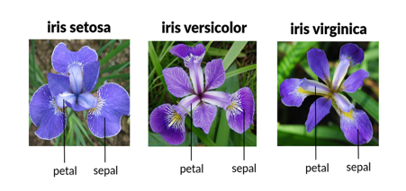
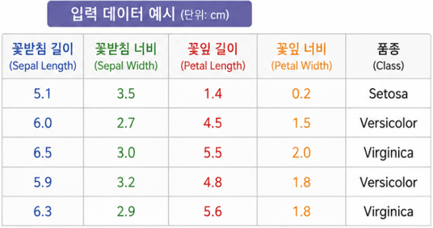

# 01. Perceptron

## 📌 실습 개요

이 실습에서는 **Iris(붓꽃) 데이터셋**을 이용하여 퍼셉트론(Perceptron)의 기본적인 연산 과정을 직접 구현합니다.

Scikit-learn의 완성된 Perceptron 모델을 바로 사용하는 것이 아니라 NumPy를 이용하여 다음 과정을 단계별로 확인합니다.

**Iris 데이터 → 데이터 추출 → 표준화 → 가중합 → 활성화 함수 → 예측 → 성능 확인**

---

## 1. Iris Dataset

Iris 데이터셋은 3종의 붓꽃으로 구성되어 있습니다.



| Class | 이름 |
|---|---|
| 0 | Setosa |
| 1 | Versicolor |
| 2 | Virginica |

각 데이터는 다음 4개의 특징(Feature)을 가지고 있습니다.

| Feature | 의미 |
|---|---|
| Sepal Length | 꽃받침 길이 |
| Sepal Width | 꽃받침 너비 |
| Petal Length | 꽃잎 길이 |
| Petal Width | 꽃잎 너비 |



각 품종별 50개씩 총 **150개의 데이터**가 존재합니다.

---

## 2. 라이브러리 불러오기

```python
import numpy as np

from sklearn import datasets
from sklearn.preprocessing import StandardScaler
```

- `numpy` : 배열 연산, 선형대수, 난수 생성, 수학 함수 등 수치 계산에 특화된 라이브러리

   **공식 문서 링크:** [NumPy Documentation](https://numpy.org/doc/stable/)
- `datasets` : Scikit-learn에서 머신러닝 학습 및 실습을 위해 제공하는 데이터셋 모듈

   **공식 문서 링크:** [Scikit-learn/dataset](https://scikit-learn.org/stable/datasets.html)

   **Scikit-learn Github:**[Scikit-learn/github](https://github.com/scikit-learn/scikit-learn)

- `StandardScaler` : Scikit-learn의 데이터 전처리(Preprocessing) 기능 중 하나이며, 
각 Feature의 평균과 데이터 범위를 일정한 기준으로 맞추기 위해 표준화(Standardization)를 수행함. 

   **공식 문서 링크:** [Scikit-learn/StandardScaler](https://scikit-learn.org/stable/modules/generated/sklearn.preprocessing.StandardScaler.html)
---

## 3. Iris 데이터 불러오기
Scikit-learn에서 제공하는 `load_iris()` 함수를 이용하여 **Iris Dataset**을 불러옵니다.

```python
iris = datasets.load_iris()

X_all = iris.data
Y_all = iris.target
```
- `datasets.load_iris()` : Scikit-learn에 내장된 Iris Dataset을 불러오는 함수
- `iris.data` : 붓꽃의 4가지 특징(Feature) 값을 저장한 입력 데이터
- `iris.target` : 각 붓꽃이 어떤 품종인지 나타내는 정답(Label) 데이터


데이터셋의 구조는 다음 명령으로 확인할 수 있습니다.

불러온 `iris`에는 입력 데이터뿐만 아니라 클래스 이름, Feature 이름, 데이터셋 설명 등 다양한 정보가 함께 저장되어 있습니다.

```python
```python
print(iris.keys())
```

실행 결과:

```text
dict_keys([
    'data',
    'target',
    'frame',
    'target_names',
    'DESCR',
    'feature_names',
    'filename',
    'data_module'
])
```

주요 항목의 의미는 다음과 같습니다.

| Key | 의미 |
|---|---|
| `data` | 4가지 Feature로 구성된 입력 데이터 |
| `target` | 각 데이터의 정답 Label (0, 1, 2) |
| `target_names` | Label에 해당하는 붓꽃 품종 이름 |
| `feature_names` | 4가지 Feature의 이름 |
| `DESCR` | Iris Dataset에 대한 상세 설명 |

```python 
    print(iris.keys())
    print(iris.target_names)
    print(iris.feature_names)
```
---

---

## 4. 이진 분류 데이터 생성

Iris 데이터에는 3개의 클래스가 있지만,
이번 퍼셉트론 실습에서는 다음 두 품종만 사용합니다.

- Setosa : 0
- Versicolor : 1

```python
mask = (Y_all == 0) | (Y_all == 1)

X = X_all[mask]
Y = Y_all[mask]
```

따라서 총 100개의 데이터를 사용합니다.

---

## 5. Label 변환

퍼셉트론의 출력을 `-1`, `+1`로 사용하기 위해
레이블을 변환합니다.

```python
Y = np.where(Y == 0, 1, -1)
```

결과:

```text
Setosa      → +1
Versicolor  → -1
```

---

## 6. 데이터 표준화

각 Feature의 값 범위가 다르기 때문에
StandardScaler를 이용하여 표준화합니다.

```python
scaler = StandardScaler()

X = scaler.fit_transform(X)
```

표준화 후 각 Feature는 대체로

```text
평균 ≈ 0
표준편차 ≈ 1
```

의 분포를 갖습니다.

---

## 7. Weight와 Bias 초기화

4개의 입력 Feature가 있으므로
4개의 Weight를 사용합니다.

```python
w = np.array([0.5, 0.5, 0.5, 0.5])

b = 0.1
```

퍼셉트론의 기본 연산은 다음과 같습니다.

\[
z = w_1x_1 + w_2x_2 + w_3x_3 + w_4x_4 + b
\]

---

## 8. Feed-Forward

모든 데이터에 대해 가중합을 계산합니다.

```python
z = X @ w + b
```

여기서 `@`는 행렬 곱셈을 의미합니다.

```text
X : (100, 4)
w : (4,)

결과

z : (100,)
```

즉, 100개의 데이터 각각에 대해 하나의 `z` 값이 계산됩니다.

---

## 9. Step Function

계산된 `z`를 Step Function에 입력합니다.

```python
y_pred = np.where(z >= 0, 1, -1)
```

즉,

```text
z >= 0 → +1
z < 0  → -1
```

로 분류합니다.

---

## 10. 정확도 확인

```python
classified = np.sum(y_pred == Y)

accuracy = np.mean(y_pred == Y)

print("정분류 개수:", classified)
print(f"Accuracy: {accuracy:.3f}")
```

---

## 11. Loss 확인

실제값과 예측값의 차이를 확인하기 위해
MSE와 MAE를 계산합니다.

```python
mse = np.mean((Y - y_pred) ** 2)

mae = np.mean(np.abs(Y - y_pred))

print(f"MSE = {mse:.3f}")
print(f"MAE = {mae:.3f}")
```

---

## 🔎 전체 과정

```text
Iris Dataset
      ↓
Setosa / Versicolor 추출
      ↓
Label 변환 (+1 / -1)
      ↓
StandardScaler
      ↓
Weight / Bias
      ↓
Weighted Sum
z = X @ w + b
      ↓
Step Function
      ↓
Prediction
      ↓
Accuracy / Loss
```

---

## 💡 생각해보기

1. Weight를 변경하면 정확도는 어떻게 변할까요?
2. Bias를 변경하면 분류 결과는 어떻게 변할까요?
3. 표준화를 하지 않으면 결과가 어떻게 달라질까요?
4. 현재 코드는 Weight를 **학습**하고 있을까요?
5. Weight를 자동으로 수정하려면 어떤 과정이 필요할까요?